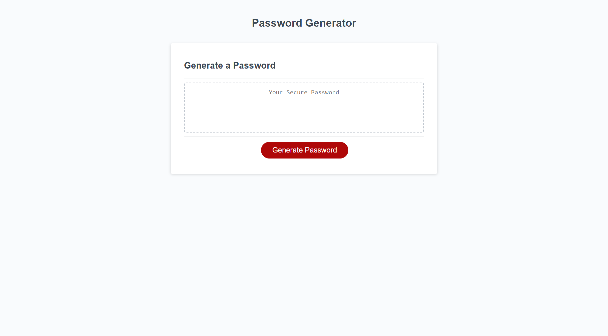

# Description
As a developer I was tasked to creating a responsive password generator that would help protect the private imformation of end users. By utilizing Arrays, four loops, varibles, and lists, I was able to achieve my goal.

# Link
https://tjbellamy.github.io/Password-Generator/

# Screenshot
